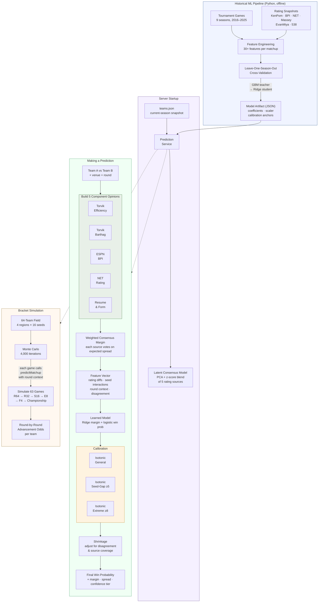

# Court Vision

See the bracket before it happens. NCAA March Madness predictions built from multi-source rating consensus, machine learning, and Monte Carlo simulation.


## What It Does

Court Vision combines multiple public college basketball rating systems into a consensus prediction model, then runs thousands of Monte Carlo simulations to project tournament outcomes.

**Three views:**
- **Matchup Predictor** — head-to-head comparison with probability breakdown and feature attributions
- **Daily Slate** — today's games with projected spreads and win probabilities
- **Bracket Simulator** — full 64-team tournament simulation with round-by-round advancement odds

## How It Works

### Prediction Flow



The prediction engine blends five component opinions (Torvik efficiency, Torvik Barthag, BPI, NET, resume/form) into a weighted consensus margin. A trained ML model (GBM-distilled Ridge regression) refines this into calibrated win probabilities using features like:

- Multi-source rating differentials (KenPom, EvanMiya, BPI, NET, Massey)
- Seed differential with nonlinear transforms
- Round-aware interactions (seed gaps matter less in later rounds)
- Cross-source disagreement (when ratings conflict, pull toward 50/50)
- Seed-gap-specific calibration (separate calibration curve for upset-prone matchups)
- Temporal weighting (recent seasons contribute more)

The model is trained on 9 seasons of tournament data (2016–2025, excluding 2020) using leave-one-season-out cross-validation.

**Current metrics** (pooled LOSO holdout, 1,132 games):

| Metric | Value |
|--------|-------|
| Log Loss | 0.566 |
| Brier Score | 0.191 |
| Calibration Error | 0.018 |
| Upset Recall | 27.3% |
| Margin MAE | 9.5 pts |

## Stack

- **Frontend:** React, Vite, shadcn/ui, Tailwind, Recharts, Framer Motion, wouter
- **Backend:** Express 5, TypeScript
- **ML Pipeline:** Python, pandas, scikit-learn, duckdb
- **Shared:** TypeScript types and Zod schemas across client and server

## Project Layout

```
client/                React SPA
server/                Express API and runtime prediction engine
shared/                Shared types and request schemas
historical_pipeline/   Data collection, dataset building, model training (Python)
data/models/           Trained model artifacts (JSON)
```

## Getting Started

### Prerequisites

- Node.js 20+
- Python 3.11+ (for the ML pipeline only)

### Development

```bash
npm install
npm run dev        # Express + Vite dev server on http://localhost:5100
```

### Production

```bash
npm run build      # Vite client + esbuild server -> dist/
npm start          # Run production bundle
```

### Type Checking & Tests

```bash
npm run check      # TypeScript type check
npm test           # Node built-in test runner
```

## Historical Model Pipeline

The pipeline collects tournament data, builds training datasets, and produces the learned model artifact used at runtime.

```bash
python3 -m venv .venv
source .venv/bin/activate
pip install -r historical_pipeline/requirements.txt

npm run historical:games      # Stage 1: collect tournament game results
npm run historical:snapshots  # Stage 2: collect pre-tournament rating snapshots
npm run historical:dataset    # Stage 3: build training dataset
npm run historical:train      # Stage 4: train model -> data/models/
```

Use `--promote-if-best` on the train stage to only promote a candidate model when it clears guardrail baselines (must beat both seed-only logit and equal-weight consensus on log loss and Brier score).

### How the Learned Model Works

The promoted model is a **GBM-distilled linear student**:

1. Gradient boosting teacher models capture nonlinear signal from the training data
2. A linear student (Ridge regression) is fit to the teacher's soft outputs
3. The exported artifact stays runtime-friendly — just standardized feature means/scales, linear coefficients, and isotonic calibration anchors

This keeps inference simple in TypeScript while benefiting from the GBM's ability to find interactions.

## Seed Snapshot

The live app uses `client/src/data/teams.json` as the current-season data snapshot. Refresh it with:

```bash
python scripts/merge_data.py
```

Required input files: `torvik_data.json`, `bpi_data.json`, `net_data.json`
Optional: `evanmiya_data.json`, `fivethirtyeight_data.json`

## Runtime Behavior

At runtime, the app loads:
1. Current-season snapshot (`client/src/data/teams.json`)
2. Promoted learned artifact (`data/models/tournament-consensus-latest.json`)
3. Prediction engine (`server/services/prediction-service.ts`)

If no learned artifact is present, the app falls back to a heuristic `latent_public_consensus` model.

## API

| Endpoint | Method | Purpose |
|----------|--------|---------|
| `/api/teams` | GET | Team list for current season |
| `/api/games` | GET | Games for a date with projections |
| `/api/predictions/matchup` | GET | Head-to-head prediction |
| `/api/predictions/bracket` | POST | Monte Carlo bracket simulation |
| `/api/model-runs/latest` | GET | Current model metadata and metrics |

## License

MIT
